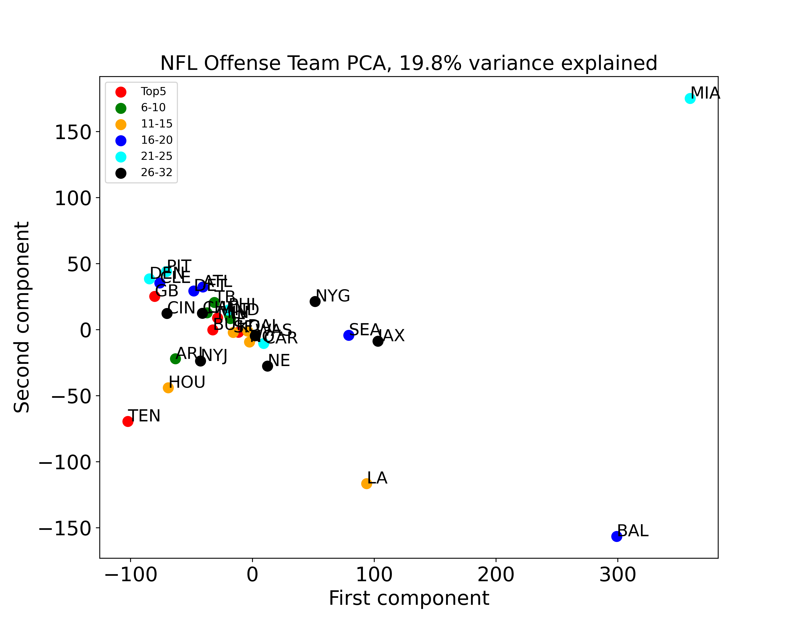
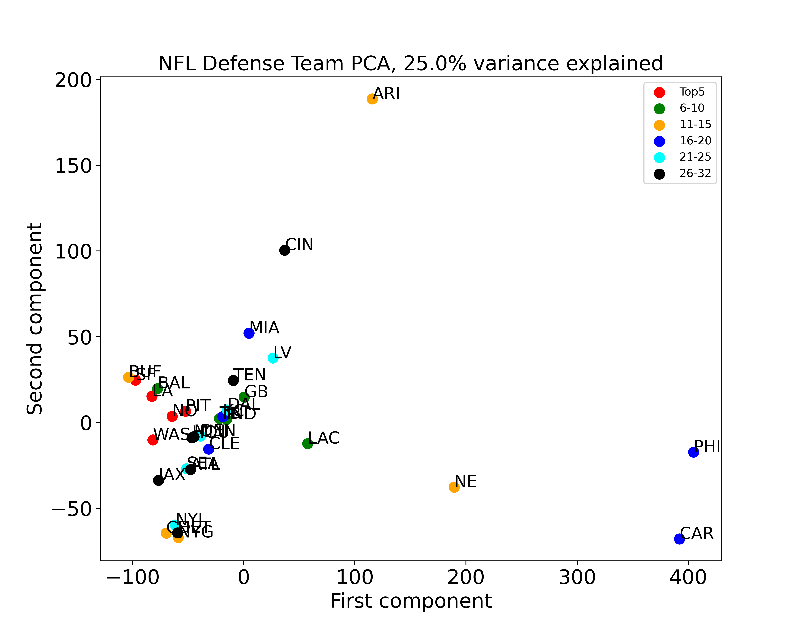

# NFL Play Calling Assistance System
<b>The Data Incubator (TDI) Capstone Project</b> 
<b>Author:</b> Wenrui Huang 
<b>Date: </b> 2022-06-09 
## Summary
In this project, I built a web app (based on a machine learning model) that can assist NFL coaches make play calls during a game in order to boost a team’s chance of winning, ultimately attracting more fans and bringing in more revenue for the organization.  
## Project Statement
The national football league (NFL), the world’s most profitable sports league, is highly competitive and each game determines a team’s fate. During the game, NFL coaches need to make play calls within 40 seconds, often facing a tremendous amount of pressure, thus tend to be error-prone. Based on the above, I propose a machine learning model (deployed as a web app) in which the coaches first submit the game information and then be provided with a list of suggested plays ranked based on chance of success to assist them make the right call during the game.
## Project Description
The goal of this project is to build a web application that can take game information from the user, process by a machine learning model and return a list of recommended plays ranked by chance of success for the user to choose from. 

### Step 1. Dataset Construction
In order to achieve this, two sets of data were utilized to build the model. The first set is the NFL play by play dataset , which includes every play of all 32 NFL teams from season year 2018 to 2021. The other dataset is the Madden NFL player rating data, which contains ratings in 43 categories of each player of all 32 NFL teams from season year 2018 to 2021.
The play by play dataset can be downloaded directly through [NFLsavant](http://nflsavant.com/about.php), in which the data for each season year were listed in separate csv tables thus need to be further combined to generate the full dataset. Exploratory data analysis was then performed with pandas profiling on the full dataset, to investigate missing values and potential correlations among variables. Finally, the full dataset were filtered and categorical features were converted to one-hot vectors for further processing.

The Madden NFL player ratings data can be accessed through [Madden Ratings](https://maddenratings.weebly.com), and downloaded using web scraping. The 2021 season data for all 32 teams were summarized in one excel table while the 2018-2020 season data were listed separately for each NFL team, thus needing to be further combined. After obtaining all the data, the rating category columns need to be renamed to make sure that the same kind of rating has the same name across all four datasets. Finally, one-hot encoded vectors were applied to replace categorical features.

During an NFL game, different formations may be used for different plays, and the players for a team on the court may vary according to play and formations, and a team may exchange or add/retire players during the off-season. Thus, in order to create a NFL play by play and player rating combined dataset for all seasons, players were selected based on their positions according to different formations listed in this wiki page and those with higher ratings were selected first. This process will be repeated for every team for each of four season years to form the final combined dataset.

### Step 2. Exploratory Analysis before Modeling
Before modeling, a simple exploratory data analysis was performed on combined dataset to see whether those NFL teams can be separated based on their offense or defense features. In order to achieve this, I extracted either offense or defense features only, and performed PCA on both subsets. As shown in the figures below, MIA and BAL standed out as outliers for offense while CAR, PHI and ARI seem to be dense outliers. This result is as expected, as in recently years, MIA is notorious for lacking in run offense while the QB of BAL, Lamar Jackson, is one of the leaders in rushing offense; on the other hand, PHI and Car have weakness in pass protection while ARI has lots of issues in run defense. 

         

### Step 3. Model Creation
The model building started with creating a new response variable that measures the success of a play, defined as the function of yards needed against total yards gained during a play. Then the combined data, together with the response variable were splitted 80-20 into train and test datasets. Data were train, cross-validated and tested on a linear and non-linear mixed model, in which data were first fit with regularized linear regression model, such as ridge, then the residuals were further fitted into a non-linear random forest regression model and both results were combined to generate the final predictions from the model. 

### Step 4. Web Application Deployment
The final product has been deployed as a web application in which the user can input self-defined game information such as offense/defense team, time, down, yards, etc. This information will be paired with the players’ rating data matched to every possible formation and pass/rush direction combinations and further processed in the backend by the built machine learning model to create a list of predictions for all possible plays. Finally, the predictions were converted into probabilities as “chance of success” using self-defined sigmoid functions, and the top 5 plays with highest “chance of success” will be translated into “Football” language and output . 

The complete workflow of this project was described in the flowchart below:  

 
## Deliverables
The webapp is deployed at [this link](https://boiling-garden-01306.herokuapp.com/)  
Github repository [click here](https://github.com/wh2353/TDI_Capstone_NFL_play_calling_assistance_system)

